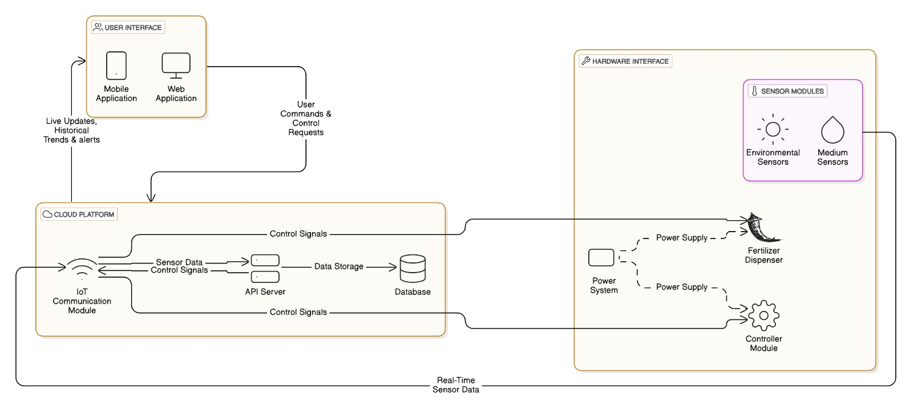

# Plant-Pulse

<!--  -->

---

## Team
-  E/20/133, Tharusha Haththella, [e20133@eng.pdn.ac.lk](mailto:e20133@eng.pdn.ac.lk)
-  E/20/305, Sachindu Premasiri, [e20305@eng.pdn.ac.lk](mailto:e20305@eng.pdn.ac.lk)
-  E/20/381, Nimesha Somathilaka, [e20381@eng.pdn.ac.lk](mailto:e20381@eng.pdn.ac.lk)
-  E/20/385, Devin Sriyarathna, [e20385@eng.pdn.ac.lk](mailto:e20385@eng.pdn.ac.lk)

<!-- Image (photo/drawing of the final hardware) should be here -->

<!-- This is a sample image, to show how to add images to your page. To learn more options, please refer [this](https://projects.ce.pdn.ac.lk/docs/faq/how-to-add-an-image/) -->

<!--  -->

## Introduction

Welcome to the future of farming! Our cutting-edge IoT-based system is designed to transform hydroponic farming into an efficient, sustainable, and user-friendly solution. By introducing smart sensor devices, we provide real-time monitoring and control like never before.

One sensor continuously analyzes the hydroponic medium, ensuring optimal conditions for plant growth, while another tracks key atmospheric parameters. Complementing these sensors is an automated fertilizer dispenser and a fluid circulation motor, maintaining a perfect balance for your crops.

With live updates and full control accessible through our mobile application, urban farmers and multidisciplinary researchers can now manage their farms with ease and precision. Our mission is to encourage urban communities to embrace farming and contribute to advancing research in sustainable agriculture.

## Solution Architecture

## Data Path

## Detailed budget

| Item                                | Quantity | Unit Cost (LKR) | Total (LKR) |  
|-------------------------------------|:--------:|:---------------:|------------:|  
| ESP32                               | 4        | 1500            | 6000        |  
| PH Sensor: pH4502C                  | 1        | 6000            | 6000        |  
| Temperature & Humidity Sensor: DHT22| 1        | 400             | 400         |  
| Turbidity Sensor: MD0591            | 1        | 2500            | 2500        |  
| Water Level Sensor: PSR-22-B2 V12767| 1        | 750             | 750         |  
| Light Intensity Sensor: GY-30       | 1        | 350             | 350         |  
| Sensor Mounting Structures          | 4        | 500             | 2000        |  
| Cabling and Connectors              | N/A      | 1000            | 1000        |  
| Power Supply: LiPo 2200mAh          | 2        | 1000            | 2000        |  
| Database and Cloud Platform         | 1 month  | 30/GB           | 3000        |  

## Links

- [Project Repository](https://github.com/cepdnaclk/e20-3yp-Monitoring-and-controlling-soilless-agricultural-plantations)
- [Project Page](http://project11968591.tilda.ws/)
- [Department of Computer Engineering](http://www.ce.pdn.ac.lk/)
- [University of Peradeniya](https://eng.pdn.ac.lk/)

